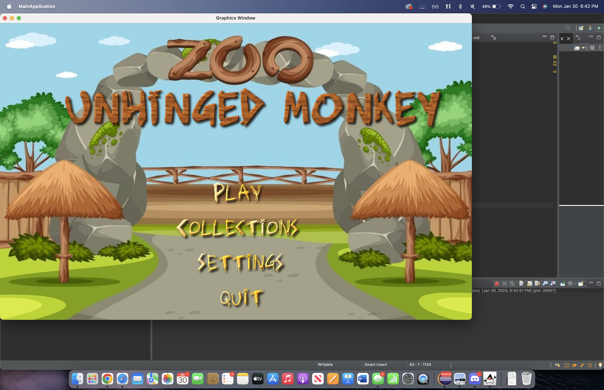
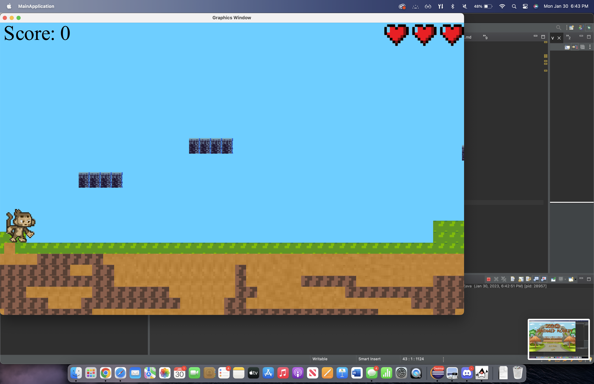
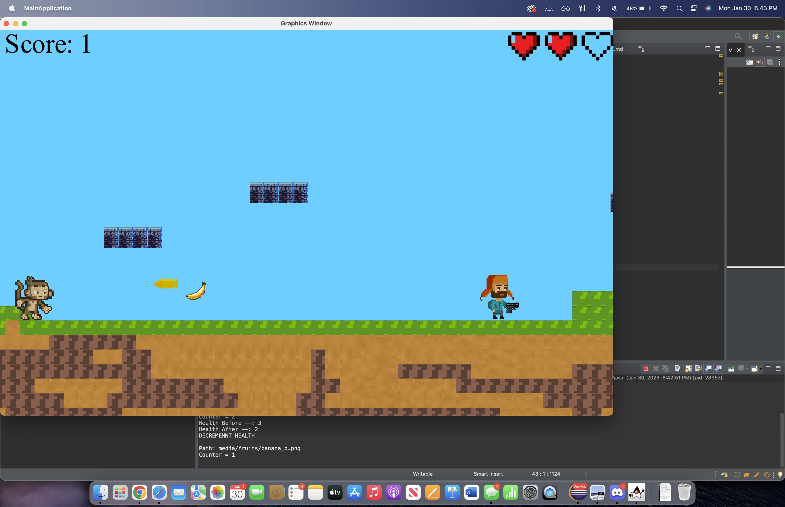

# Comp 55 Resurrection Project

In order to run this project, download the zip file and run the MainApplication.java file.

For my resurrection project, the feature that I decided to implement was making the screen uniform on all devices that run this game! Before working on this task, when the game is launched by the user it will not take the full screen and has lots of white space if the device is bigger than a 11". I want to fix this issue so that way the user can take full advantage of all screen space given to them on their machine. When the user clicks through the different menus there are lots of issues with uniformity and this creates a bad UX experience for the user. 

When I was cloning this file I was running into lots of issues with Eclipse and it was asking me for an "Ant File" to build the application. I messaged Osvaldo about this via discord and he told me to detail what changes I tried and how I implemented the necessary changes. Therefore I will have only one commit as I will have to force push the local repository to my Github repository once I am finished.

In order to complete this change, I had to figure out first where in my code I was launching all of the window screen sizes and figure out where to add the code that will scale the screens appropriately. This was done in the MainApplication.java file. From here I had to figure out what each function was doing because originally I was not assigned to be working on this portion of the code. After I did some research online I was able to come up with a gameplan for what I had to accomplish. In each of the functions that skip to another screen I will have to set a default height and width that will make the game uniform on each screen. 

However, my initial idea to do this was to set a maximum width and height and once this size is reached the user should no longer be able to make the window larger. In order to do this I thought the best solution was by finding a function in the ACM library that would make the window not resizable by the user. The only problem was there was not a function in the library that could do this. So after further research and countless hours spent, I found out that I could incorporate the JFrame library into my project and utilize the setNonResizable() function, but for some reason when I created this new class I ran into lots of problems and the code was not working properly. So when I ran into this error, I reached out to Osvaldo and he gave me the idea to set a maximum and minimum width/height so that way the screen would be scaled for each device and the game would not have any leading whitespace. I was able to accomplish this step successfully! 

I was able to do this by adding to functions that already existed within my code. I added code to the init() and run() functions that were already made from before. And from here after figuring out where I needed to add the new code (which was the hardest part of the assignment) it was fairly simple to set a min/max width and height! From there it was just figuring out the proper values to set the minimum and maximum to and once I figured that out I hardcoded the values into the game so that way all screens would be uniform and there would be no issues for a new user playing the game!

The Pseudocode that is written below is the simpler way that I thought about solving this issue. Initially I wanted to create a new class that would inherit from the JFrame library and create some sort of aspect ratio along with a function that would not allow the window to be resizable from the user. I would then call this class where my screens are being initialized  but this method was not working.  And after reaching out to Osvaldo, he gave me this new idea to solve this problem. This way there was less code to change and this would still allow my features to be implemented.

Pseudocode: 
Initialize width to 1350

Initialize height to 800

Figure out where in the code, where each function and new screens are being initialized

Call these variables with a function that will set the minimum width and height of the application

Call these variables with a function that will set the maximum width and height of the application

Look for all menus and screens that are being called and add the appropriate function inside to set Min/Max width and heights. 

In order to make sure that the correct width and height is set return the value of the width/height to check and test 

This will ultimately allow for no whitespace to be shown to the user and will create a more seamless experience for the user.

